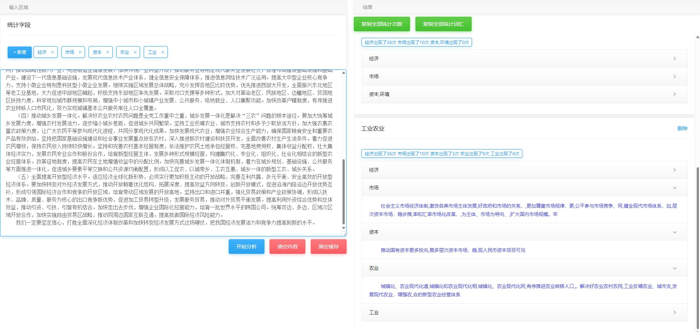

#  文章关键字统计工具

帮研究生朋友做的文章关键字统计工具,可分析文章特定词汇的出现评率,复制生成excel,生成图形分析等。

[在线体验](https://sweetwisdom.github.io/KeyWord-CountTool/)

> 主要功能✅: 
>
> - [x] 关键词增删改查
>
> - [x] 分析比对
> - [x] 统计词汇所在的句子
> - [x] 本地缓存
>
> 

## 使用效果

## 使用方法

[在线体验](https://sweetwisdom.github.io/KeyWord-CountTool/)

### 本地使用

1. 下载项目

2. 浏览器打开index.html

